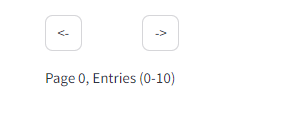

# Spotify_Recommendation_Engine
This is the documentation of the project.

## Used technologies
 

## Dependencies
Following packages are required for this project in overall:
* streamlit
* pandas 
* numpy 
* plotly
* plotly.express 
* pickle
* os
* sklearn
* sklearn.neighbors 
* sklearn.model_selection
* matplotlib
* matplotlib.pyplot
* importlib
* ast 
* pathlib  
* warnings

## How to run
To run the project, just navigate to **app/view** folder and execute **main.py**
using **streamlit run main.py**.

## Clustering Rule based Approach (CRA) 
The following section provides information on the algorithm used to label the data for KNN.

### Description of the algorithm
The algorithm used to label the data is so called rule-based classifier (https://www.geeksforgeeks.org/rule-based-classifier-machine-learning/).   
Following features were chosen to train the algorithm: **danceability**, **valence**, **instrumentalness** and **energy**.

The algorithm labels the data using the following steps:
1. Categorize danceability into four categories
    * If danceability < 0.25 => very undanceable
    * If danceability >= 0.25 and < 0.5 => undanceable
    * If danceability >= 0.5 and < 0.75 => danceable
    * If danceability >= 0.75 and <= 1 => very danceable
2. Categorize valence into four categories
    * If valence < 0.25 => very negative
    * If valence >= 0.25 and < 0.5 => negative
    * If valence >= 0.5 and < 0.75 => positive
    * If valence >= 0.75 and <= 1 => very positive
3. Categorize instrumentalness into four categories
    * If instrumentalness < 0.25 => very low
    * If instrumentalness >= 0.25 and < 0.5 => low
    * If instrumentalness >= 0.5 and < 0.75 => high
    * If instrumentalness >= 0.75 and <= 1 => very high
4. Categorize energy into four categories 
    * If energy < 0.25 => very low
    * If energy >= 0.25 and < 0.5 => low
    * If energy >= 0.5 and < 0.75 => high 
    * If energy >= 0.75 and <= 1 => very high
5. Map every category to a digit
    * **danceability** (0 = very undanceable, 1 = undanceable, 2 = danceable, 3 = very danceable)
    * **valence** (0 = very negative, 1 = negative, 2 = positive, 3 = very positive)
    * **instrumentalness** (0 = very low, 1 = low, 2 = high, 3 = very high)
    * **energy** (0 = very low, 1 = low, 2 = high, 3 = very high)
6. Create a label by composing the digits into a string of the format **"daceability-digit,instrumentalness-digit,valence-digit,energy-digit"**
  **Example**: 0,1,2,3 => very undanceable, low instrumentalness, positive valence, very high energy

### Labeled data
The following plot shows the predicted labels for the test set.

In order to create a prediction, the algorithm calculates a label using the KNN and returns all songs with the same label as recommendations.

## Preprocessing (***descriptive_analysis*** folder)
This folder contains all steps necessary to preprocess that data needed to train the machine learning algorithm (see [this subsection](#machine-learning-header)).
The preprocessing was done in the notebook **preprocessing.ipynb**. 
To find the notebook, just navigate to the folder **descriptive_analysis**.

> <code style="color : red">**Caution:**</code> The notebook was already executed by the time you are reading this, so **note that a repeated execution of the notebook may take a significant amount of time (ca. 13 minutes) due to the complexity of data preprocessing**.   **You do not have to execute this notebook again**.

Following important steps were performed in this notebook:
* Reading tracks CSV file
* Reading albums CSV file
* Reading artists CSV file
* Reading lyrics features CSV file
* Cleaning of some columns (e.g. converting string lists into Python lists)
* Joining the CSV files mentioned above into one data frame
* Dropping unnecessary columns
* Reducing the genres into main genres
  -  avant-garde
  - experimental
  - blues
  - country
  - easy listening
  - electronic
  - folk
  - hip hop
  - rap
  - jazz
  - pop
  - soul
  - r&b
  - rock
  - metal
  - punk 
   Other genres will be simply marked as *other*.
* Storing the preprocessed data frame as a CSV

The preprocessed data frame can be found under **spotify_data/preprocessed.csv**.

## Machine Learning (***machine_learning_algorithm*** folder)
This folder contains all steps necessary to train the KNN algorithm using the preprocessed data.
The training of the machine learning algorithm was done in the notebook **machine_learning.ipynb**. 
To find the notebook, just navigate to the folder **machine_learning_algorithm**.
> <code style="color : red">**Caution:**</code> The notebook was already executed by the time you are reading this, so note that a repeated execution may change the resulting KNN model with its parameters. **You do not have to execute this notebook again**.

Following important steps were performed in this notebook:
* Data conversion
* Rescaling
* Check for NA values
* Labeling of the data
* Split to train and test set
* Finding suitable KNN parameters using RandomizedSearchCV
* Training the model
* Plotting the labels of the data using a scatter matrix
* Storing the model as pickle file
* Storing the original data frame as pickle file

The pickle file of the model can be found under **app/model/model.pkl**.  
The pickle file of the data frame can be found under **app/model/data.pkl**.

## Streamlit app (***app*** folder)
The following section describes the app.

### App structure
The Streamlit app consists of two folders:
* **model** 
  Contains the business logic of the application.
* **view** 
  Contains the view layer of the application.

To run the project, just navigate to **app/view** folder and execute **main.py**
using **streamlit run main.py**.

The list consists of songs that are underneath each outer one column.  
You can specify the range by the criteria that can be seen on the left side (the same ones used to train the algorithm).  
You can specify the genre on the right side.  
You can search for specific artist or track.  
The search always takes place within the set criteria and the selected genre.

 
Each track consists of a button for generating recommendations and a dropdown where you can view more details. 
 

 
The details consist of the track name, artists' names and a spider chart depicting the size of features that were used to train the algorithm.
 

 
If you scroll down to the bottom of the list, you can see the paginator used for navigation (you can only see 10 tracks at once).
 

### How to retrieve recommendations
1. Search for some song (e.g. I searched for **vincent** in the genre **Jazz**, all range criteria between 0 and 1).

2. Click on **Get recommendations** (I clicked on **Personal Touch**). As you can see, the search modus switches to **Recommendations**.  
The recommendations in the genre **Jazz** are generated und you can see all recommended tracks in the list.  
If you want to see recommended tracks from other genres and features (criteria), you have to adjust the parameters (e.g. change genre, danceability, valence etc.).

You can see that the recommended tracks have similar feature structure of the spider chart (there are only slight differences).  
The screenshots show the spider charts of the first three recommendations.  

3. Deactivate the recommendations search by clicking on **Turn off recommendations search**.  
   You can see that the search modus switched to **Main (recommendations deactivated)**.  
  You can see all tracks with predefined limitations (genre, criteria) again.
